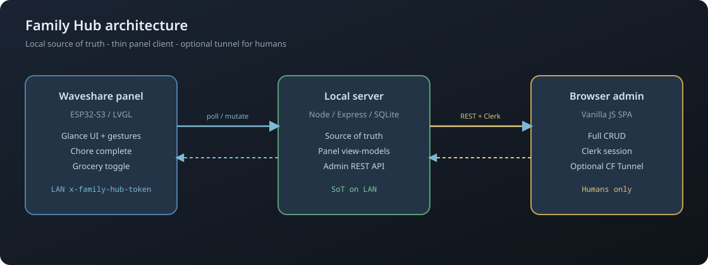
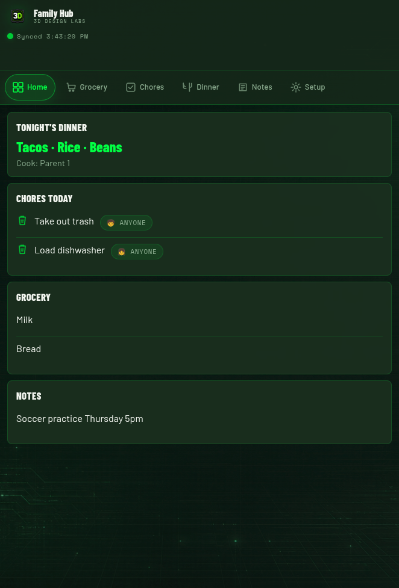
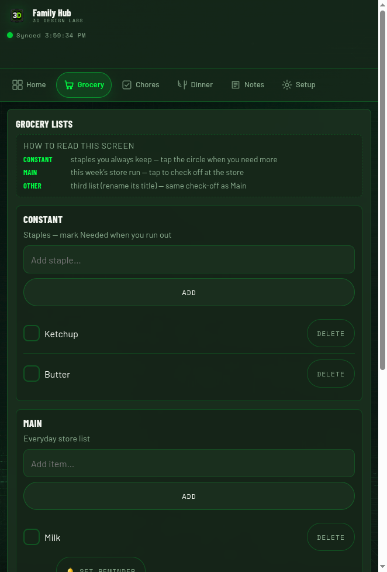
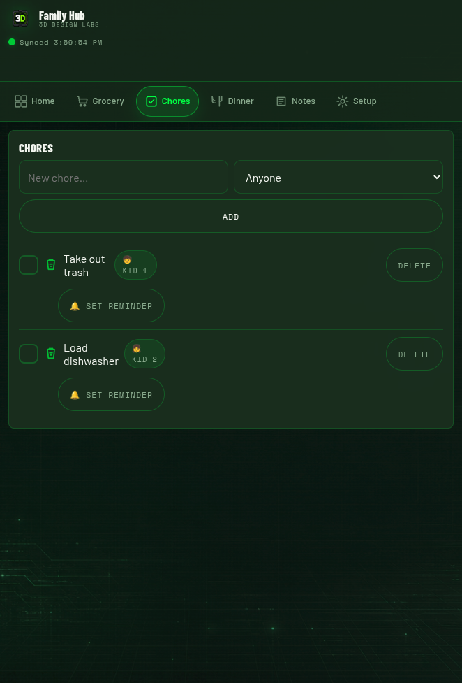

# Family Hub

Family Hub is a household operations hub: grocery lists, chores, dinner plans, and notes — with a **Waveshare ESP32-S3 wall panel** as a thin display/input client and a **local Node + SQLite server** as the source of truth.

The browser admin UI is for humans. The panel stays on the LAN. Optional Cloudflare Tunnel + Clerk cover signed-in access from outside the house.

## Gallery

Architecture diagram and browser admin UI. Waveshare panel hardware / on-device UI close-ups are still pending — use the real panel only (no stand-in displays).



| Home | Grocery | Chores |
| --- | --- | --- |
|  |  |  |

## Architecture

```text
Waveshare panel (ESP32-S3)     Local server              Browser
──────────────────────────     ────────────              ───────
LVGL UI, gestures, sleep       Express + SQLite SoT      Admin CRUD
HTTP poll + chore/grocery     Panel contracts (VMs)     Clerk session
LAN + PANEL_TOKEN              Optional WRITE_TOKEN      Optional tunnel
```

| Layer | Path | Role |
| --- | --- | --- |
| API + DB | [`server/`](./server/) | Source of truth |
| Web admin | [`web/`](./web/) | Browser UI (served by the server) |
| Panel firmware | [`firmware/`](./firmware/) | Thin LVGL client (Waveshare primary) |
| Hardware / case | [`hardware/`](./hardware/) | OpenSCAD wall case + measurements |
| Docs | [`docs/`](./docs/) | Contracts, ADRs, deploy notes |
| Deploy | [`deploy/`](./deploy/) | systemd unit examples |

**Household-only.** Rewards/behavior and child-panel products were archived and are not part of the live tree — see [`archive/`](./archive/). Historical reward/discipline design notes live in [`archive/reward-discipline-architecture-historical.md`](./archive/reward-discipline-architecture-historical.md).

## Auth split

| Client | Auth |
| --- | --- |
| Browser humans | Optional [Clerk](./docs/auth-clerk-cloudflare.md) (+ Cloudflare Tunnel) |
| Wall panel | LAN + optional `PANEL_TOKEN` / write token via `x-family-hub-token` header only — no query-string tokens, no OAuth on-device |

Panel mutations are restricted to **chore completion** and **grocery-state toggles**. App tab URL + QR prefer the public app URL when the server publishes `public_app_url`.

## Security

Household product security is documented for portfolio review (no live secrets or home network details):

- [Threat model](./docs/security/threat-model.md) — assets, trust boundaries, attack scenarios, STRIDE
- [Security pass (sanitized)](./docs/security/security-pass.md) — findings, fixes, accepted residual risk

Highlights: Clerk for browser humans vs LAN panel token; panel credentials rejected on the public tunnel; header-only tokens (no `?token=` in logs); panel cannot perform admin CRUD; safety boundaries keep locks/HVAC out of scope.

## Hardware (wall case)

Parametric OpenSCAD enclosure for the Waveshare 7B: adhesive panel mount, two Velcro Command strips to the wall, MX switch bay, open access for USB-C / Boot / Reset / SD.

- Source: [`hardware/cad/family-hub-7b-case.scad`](./hardware/cad/family-hub-7b-case.scad)
- Notes: [`hardware/docs/case-7b.md`](./hardware/docs/case-7b.md)

## Panel gestures (Waveshare)

| Action | Gesture |
| --- | --- |
| Sleep | Double-tap header |
| Wake | Any tap |
| Diagnostics | Hold header ~2s |

Panel API contract: [`docs/api/panel-contracts.md`](./docs/api/panel-contracts.md). Stack defaults: [`docs/adr/007-stack-defaults.md`](./docs/adr/007-stack-defaults.md).

## Stack

- **Panel:** ESP32-S3 (Waveshare Touch LCD 7B), LVGL 8, PlatformIO / Arduino
- **Server:** Node.js, Express, SQLite
- **Web:** Vanilla JS admin SPA
- **Auth (optional):** Clerk + Cloudflare Tunnel

## Quick start (dev)

```bash
cd server
cp .env.example .env   # optional Clerk / tokens
npm install
npm run init-db
HOST=127.0.0.1 PORT=3020 npm start
```

Open `http://127.0.0.1:3020`.

Firmware: copy [`firmware/include/secrets.example.h`](./firmware/include/secrets.example.h) → `secrets.h`, then:

```bash
cd firmware
pio run -e waveshare7b
# pio run -e waveshare7b -t upload
```

More deploy notes: [`docs/endeavor-deploy.md`](./docs/endeavor-deploy.md).

## Documentation

- [Threat model](./docs/security/threat-model.md)
- [Security pass](./docs/security/security-pass.md)
- [Panel API contracts](./docs/api/panel-contracts.md)
- [ADRs](./docs/adr/README.md)
- [Clerk + Cloudflare](./docs/auth-clerk-cloudflare.md)
- [Panel UX addendum](./docs/panel-ux-cleanup-addendum.md)

## License

[MIT](./LICENSE).

## Status

Public portfolio cut. Home deployment, secrets, and runtime databases stay out of git.
