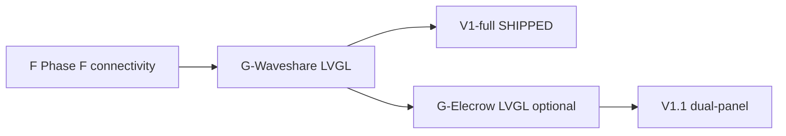

# Panel Targets — Dual 7" Support

Family Hub supports two ESP32-S3 7" touch panels. **One firmware tree**, **one server API**, **compile-time panel selection** via PlatformIO env + `#ifdef`.

**Panel setup hub:** this file + panel-specific reference docs below.

| Reference | Panel |
|-----------|--------|
| [waveshare-esp32-s3-touch-lcd-7-reference.md](waveshare-esp32-s3-touch-lcd-7-reference.md) | Waveshare (primary) |
| [elecrow-esp32-display-7-reference.md](elecrow-esp32-display-7-reference.md) | Elecrow (secondary) |
| [waveshare-setup.md](waveshare-setup.md) | Serial commands, secrets, env quick start |

---

## Comparison

| | **Waveshare ESP32-S3-Touch-LCD-7** | **Elecrow CrowPanel 7" HMI** |
|---|-----------------------------------|------------------------------|
| **Priority** | **Primary** — V1-full required | **Secondary** — V1.1 bonus |
| **PlatformIO env** | `waveshare7` | `elecrow7` |
| **Build flag** | `WAVESHARE_7=1` | `ELECROW_7=1` |
| **MCU module** | ESP32-S3 (8 MB flash typical) | ESP32-S3-WROOM-1-**N4R8** (4 MB flash) |
| **PSRAM** | 8 MB | 8 MB |
| **Resolution** | 800×480 | 800×480 |
| **Display stack** | ESP32_Display_Panel + ESP32_IO_Expander | **LovyanGFX** (RGB bus) |
| **Display driver** | Waveshare RGB + **CH422G** expander | **EK9716BD3** + **EK73002ACGB** |
| **Touch** | GT911 (I²C GPIO8/9) | **GT911** (I²C GPIO19/20) |
| **LVGL** | 8.4.0 (Waveshare examples) | 8.3.x (Elecrow SquareLine; match export) |
| **Board name** | `Waveshare ESP32-S3-Touch-LCD-7` or `esp32-s3-devkitc-1` | Custom **`esp32-s3-devkitc-1-myboard`** (Elecrow JSON) |
| **Official docs** | https://docs.waveshare.com/ESP32-S3-Touch-LCD-7 | https://www.elecrow.com/wiki/CrowPanel_ESP32_7.0-inch_with_PlatformIO.html |

---

## Shared thin-client contract (unchanged)

Both panels run the same Family Hub firmware architecture:

| Layer | Shared behavior |
|-------|-----------------|
| **API** | `GET /api/dashboard-state`, `POST /api/events` |
| **State** | Server is source of truth; panel caches in SPIFFS only |
| **Screens** | Home, Grocery, Chores, Dinner, Notes, Settings (`ScreenId`) |
| **Connectivity** | WiFi + offline/stale badge semantics |
| **Writes** | `submitEvent` → grocery/chore/dinner/note actions |
| **Config** | NVS: `srv_host`, `srv_port`, `write_tok` |
| **ui_manager** | Same hooks: `render()`, `renderStatusBar()`, per-screen `render*()` |

Panel-specific code lives **only** under `#ifdef WAVESHARE_7` or `#ifdef ELECROW_7` — display init, LVGL flush, touch read. Business logic stays in shared `.cpp` files.

---

## Compile-time selection strategy

```text
firmware/platformio.ini
  [env:devkit]      → FAMILY_HUB_DEVKIT=1   (serial UI, CI)
  [env:waveshare7]  → WAVESHARE_7=1         (production primary)
  [env:elecrow7]    → ELECROW_7=1           (optional secondary)

firmware/src/ui_manager.cpp
  #ifdef WAVESHARE_7
    // Waveshare LVGL hooks (ESP32_Display_Panel)
  #elif defined(ELECROW_7)
    // Elecrow LVGL hooks (LovyanGFX + GT911)
  #endif
  // shared serial fallback + screen data rendering
```

**Rules:**

- Never define both `WAVESHARE_7` and `ELECROW_7` in one env.
- Default production env: **`waveshare7`** (`default_envs` stays `devkit` for CI).
- Elecrow work must not add deps to `waveshare7` or `devkit`.

---

## Phase G execution order

| Phase | Panel | V1 scope | Blocker |
|-------|-------|----------|---------|
| **G-Waveshare** | Waveshare 7" | **Required for V1-full** | Panel hardware + libs |
| **G-Elecrow** | Elecrow 7" | **Optional V1.1 bonus** | Waveshare G complete; Elecrow hardware |



1. **Phase F** — WiFi + dashboard fetch (devkit or either panel).
2. **G-Waveshare** — LVGL on Waveshare; photo evidence; checklist P10–P16.
3. **G-Elecrow** — Only after Waveshare path proven; reuse `ui_manager` hooks with LovyanGFX init.

If only one panel is owned: use Waveshare path. Elecrow doc exists so a second unit does not require architecture rework.

---

## Resume instructions

### Waveshare (primary)

```bash
# secrets + build
cp firmware/include/secrets.example.h firmware/include/secrets.h
export PATH="$PWD/.venv-pio/bin:$PATH"
cd firmware && pio run -e waveshare7

# When hardware ready: add libs per waveshare-esp32-s3-touch-lcd-7-reference.md
# Flash: pio run -e waveshare7 -t upload
```

Agent prompt: *Run Phase F then G-Waveshare from `docs/v1-roadmap/v1-phase-plan.md` using `docs/waveshare-esp32-s3-touch-lcd-7-reference.md`.*

### Elecrow (secondary)

```bash
# After Waveshare G passes (or in parallel if you only own Elecrow — still use elecrow7 env)
export PATH="$PWD/.venv-pio/bin:$PATH"
cd firmware && pio run -e elecrow7

# Install Elecrow board JSON + LovyanGFX stack per elecrow-esp32-display-7-reference.md
# If touch fails: see Troubleshooting §4 (V3.0 PCA9557)
```

Agent prompt: *Implement G-Elecrow optional track from `docs/v1-roadmap/v1-phase-plan.md` using `docs/elecrow-esp32-display-7-reference.md`. Do not modify waveshare7 deps.*

---

*Decision D-38: dual panel; Waveshare primary, Elecrow secondary.*
